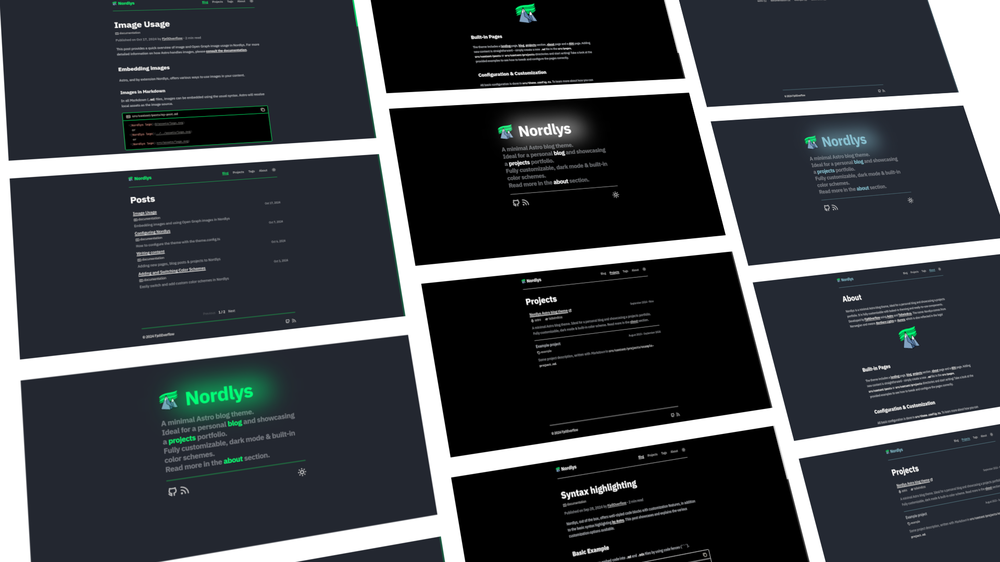

  

<h1 align="center">
  <a href="https://nordlys.fjelloverflow.dev">Nordlys</a>
</h1>

  A minimal Astro blog theme

  <picture>
    <source media="(prefers-color-scheme: light)" srcset="https://img.shields.io/github/package-json/v/FjellOverflow/Nordlys?label=Version&labelColor=000000&color=success">
    <source media="(prefers-color-scheme: dark)" srcset="https://img.shields.io/github/package-json/v/FjellOverflow/Nordlys?label=Version&labelColor=ffffff&color=success">
    
  </picture>
  &ensp;
  <picture>
    <source media="(prefers-color-scheme: light)" srcset="https://img.shields.io/github/actions/workflow/status/FjellOverflow/Nordlys/cd.yaml?branch=main&label=Build&labelColor=000000">
    <source media="(prefers-color-scheme: dark)" srcset="https://img.shields.io/github/actions/workflow/status/FjellOverflow/Nordlys/cd.yaml?branch=main&label=Build&labelColor=ffffff">
    
  </picture>
  &ensp;
  <picture>
    <source media="(prefers-color-scheme: light)" srcset="https://img.shields.io/github/license/FjellOverflow/Nordlys?label=License&labelColor=000000&color=success">
    <source media="(prefers-color-scheme: dark)" srcset="https://img.shields.io/github/license/FjellOverflow/Nordlys?label=License&labelColor=ffffff&color=success">
    
  </picture>

  <a href="https://nordlys.fjelloverflow.dev">Preview</a> |
  <a href="#installation">Installation</a> |
  <a href="#getting-started">Getting started</a> |
  <a href="#documentation">Documentation</a> |
  <a href="#stack">Stack</a>

> [!IMPORTANT]  
> This theme is in early development. If you come across bugs, mistakes or have suggestions on the direction of the project, feel free to [open an issue](https://github.com/FjellOverflow/nordlys/issues/new/choose)!

## Installation

0. Make sure you have [pnpm](https://pnpm.io/installation) installed on your system.

1. - Clone or [fork](https://github.com/new?template_name=nordlys&template_owner=FjellOverflow) this repository or
   - Create a new project with `pnpm dlx create-astro --template FjellOverflow/nordlys`.

2. Run `pnpm install`.

3. Run `pnpm dev`.

4. (To install the recommended extensions for VSCode, open the _Extensions_ tab and type `@recommended`.)

## Getting started

The look and feel of the theme are configured in `theme.config.ts`. Make sure to adjust the title, author, URL, and color scheme to your preferences. Defaults are provided for most settings.

All content is written in Markdown or MDX. Adding new pages, blog posts, or projects is as simple as creating a `my-latest-post.md` file in the appropriate directory and adjusting the frontmatter. For specific properties that can or need to be set, refer to the provided examples.

## Documentation

The theme is self-documenting. Just head over to [nordlys.fjelloverflow.dev](https://nordlys.fjelloverflow.dev/posts/) for examples and tutorials on how to use and customize the theme.

## Stack

- **Language**: TypeScript
- **Framework**: [Astro](https://astro.build/)
- **Styling**: [TailwindCSS](https://tailwindcss.com/)
- **Font**: [IBM Plex Sans](https://fonts.google.com/specimen/IBM+Plex+Sans)
- **Icons**: [Tabler Icons](https://tabler.io/icons)
